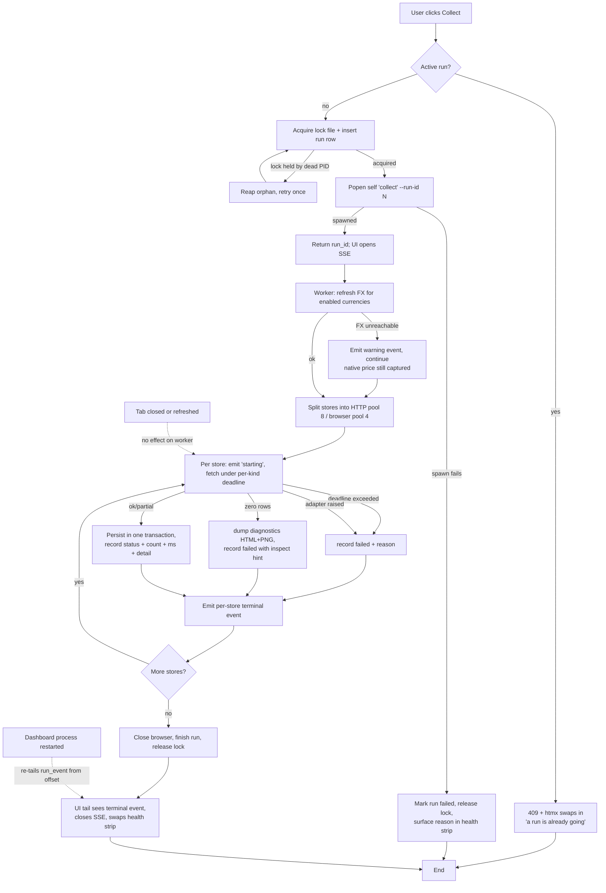

# HLD — switch-tracker Python/FastAPI rewrite: feasibility & architecture

## 0. Provenance

| | |
|---|---|
| **Date** | 2026-08-21 |
| **Status** | **approved** — open questions resolved 2026-08-21; size constraint lifted by the engineer |
| **Spec source** | `docs/python-rewrite-plan.md` (uncommitted, +362/−69 vs HEAD) |
| **Added constraint** | Single `.exe`, dashboard-driven, every capability a UI control (this session; overrides the plan's *"Distribution (later, not day one)"*) |
| **Parity yardstick** | Capability inventory read from all 20 source files, not from the plan |
| **Excluded evidence** | `Results.txt` — a stale local capture; the live database is on the user's Windows machine and was not inspectable from this checkout |
| **Supersedes** | None |

**Scope of this document:** is the rewrite plan feasible, and is there a better alternative?
It does **not** critique the current TypeScript design.

---

## 1. Problem & Constraints

**Verdict: the plan is feasible and its stack is well chosen — but two decisions in it break under the single-exe constraint, and one of them re-introduces a failure the plan itself lists as a hard-won lesson.**

### What the plan asks for
- Port a working ~3,500 LOC Bun/TypeScript price tracker to Python 3.12 + FastAPI.
- Lose no capability without a written reason.
- Stated motivation is explicitly **career/learning** — a second stack unlike Java/Spring, high demand at Indian product companies.

### What bounds the solution space
| Constraint | Source | Bite |
|---|---|---|
| Single `.exe`, all controls on the dashboard | This session | Primary architectural driver |
| Playwright must survive freezing | Plan L441 | **Hard collision** — see §3.B |
| Collect runs up to 600 s per browser store | Current `BROWSER_DEADLINE_MS` | Rules out request-scoped work |
| Headed browser needed for "Fix a broken store" | Plan L469 | Forces a subprocess in every option |
| Native price is the fact, INR derived | Plan non-negotiable | Schema-level; carried unchanged |
| Filtering/sorting/aggregation in SQL | Plan non-negotiable | Favours stdlib `sqlite3`; plan is right |
| No per-store numeric limits | Plan non-negotiable | Carried; ceilings stay universal |
| Personal, local, single-user, `127.0.0.1` | Plan | No auth, no multi-tenancy, no scaling tier |

### Safety gates
- **W-1 (hardware safety):** `N/A — no wafer, cassette, interlock or alarm surface. This is a consumer price tracker.`
- **W-2 (layer boundary):** `Adapted — the Application→Flow→Device→Controller hierarchy does not exist here.` The equivalent rule enforced below is this project's own layering: **UI/API → orchestration → adapters → core (parse/db/http)**, dependencies top-down only, and **no adapter may depend on another adapter**. Every option in §2 is checked against it.

---

## 2. Solution Options

### Option 1 — Plan as written, packaged as a folder

- **Shape.** Exactly the plan: FastAPI routers → services → adapters → core. SSE `StreamingResponse` per button, the work running *inside* the streaming generator. Playwright with a bundled Chromium; PyInstaller `onedir`.
- **Spec fit.** Satisfies the plan literally. Every button streams live output. Minimum deviation, so the plan stays reviewable against itself.
- **SOLID reading.**
  - *SRP* — **strained.** One object both *executes* a collection run and *serves* it to a viewer. Two reasons to change (collection policy; presentation) in one place.
  - *OCP* — honoured. A new store kind is a new adapter registered in a mapping, not an `if` in a shipped one.
  - *LSP* — honoured. Every adapter returns the same `ok | partial | failed` outcome contract, matching today's `FetchOutcome`.
  - *ISP* — honoured. Adapters expose only `fetch(store)`; probe/inspect concerns stay separate.
  - *DIP* — **strained.** Services reach Playwright and `sqlite3` concretely; nothing inverts the browser dependency, so the packaging choice leaks into business logic.
  - *Driven by:* nothing — it is a transcription, not a design.
- **Workaround check.** ⚠️ **Special case.** "Fix a broken store" cannot run inside a streaming response (headed window), so it alone spawns a subprocess while every other action runs in-process. One action off the main mechanism, permanently.
- **How it fails.** SRP breaks first and hardest. Closing the tab cancels the generator and **kills a 600 s collection mid-run**; a refresh starts a *second* run. That is precisely the plan's own hard-won lesson #7 (*"a UI default that silently repeats the last expensive action is a real trap"*) reproduced in the web UI.

### Option 2 — Job-runner core: separate executing a run from observing one

- **Shape.** Re-partition under SRP. A **run registry** owns background `asyncio` tasks and an append-only in-memory event log per run. Buttons `POST` and return a `run_id` immediately. SSE is a **read-only subscriber** with replay-from-offset, so a reconnecting tab catches up. Playwright resolved behind a browser-provider abstraction (installed Edge/Chrome via `channel=`, bundled Chromium as fallback).
- **Spec fit.** Everything the plan wants, plus tab-independence the plan doesn't have. A double-clicked button is rejected by the registry, not by luck.
- **SOLID reading.**
  - *SRP* — **honoured, and it drove this option.** Execution, observation and delivery are three owners.
  - *OCP* — honoured. New action types register as job kinds; the SSE layer never changes.
  - *LSP* — honoured. Every job kind emits the same event contract, so the UI renders any job uniformly.
  - *ISP* — honoured. The UI depends on a subscribe-only interface; it cannot reach execution controls it has no business calling.
  - *DIP* — honoured. Browser acquisition sits behind a provider seam, so packaging changes never touch adapter logic.
  - *Driven by:* **SRP**, with DIP securing the packaging seam.
- **Workaround check.** ⚠️ **Special case, unavoidable in this shape.** The headed inspect flow still cannot be an in-process job — it remains the one action that spawns a subprocess.
- **How it fails.** ISP holds, but **process isolation is absent**: a hung Chromium or a Playwright driver crash lives in the dashboard's own process and takes the UI down with it. Blocking `sqlite3` writes in a large transaction stall the event loop that is simultaneously serving SSE.

### Option 3 — Uniform self-invoked worker: the exe re-invokes itself for all long work *(recommended)*

- **Shape.** Reframe the problem. The exe has an argv dispatcher (`serve` | `collect` | `probe` | `fx` | `inspect`). The dashboard process **never** runs a scrape and **never** loads Playwright. Every long action is the same thing: `Popen([sys.executable, <subcommand>, ...])`. Workers write progress to a `run_event` table; the UI process tails that table and re-broadcasts it over SSE. A single "active run" row plus an OS lock file is the concurrency guard.
- **Spec fit.** Satisfies the plan and the exe constraint together. Progress survives a closed tab, a refreshed page, *and* a restarted dashboard — because the event log is on disk, not in memory.
- **SOLID reading.**
  - *SRP* — honoured. UI process serves; worker processes collect; neither knows the other's internals.
  - *OCP* — honoured. A new action is a new subcommand; the dashboard's job-launching code is untouched.
  - *LSP* — honoured. Every worker honours one contract: emit events, exit with a status. The UI substitutes any worker for any other.
  - *ISP* — honoured. The UI process's dependency surface shrinks to *"launch a subcommand, read a table"* — it does not import Playwright, adapters, or the classifier at all.
  - *DIP* — **honoured most strongly of the four.** The dependency is inverted onto the process boundary and the `run_event` table. The dashboard depends on a data contract, not on scraping code.
  - *Driven by:* **DIP**, with ISP as the decisive secondary — the UI process's import graph is the thing being minimised.
- **Workaround check.** ✅ **Structural — no special case.** This is the option's main argument: **the subprocess mechanism is mandatory anyway** (Options 1 and 2 both concede it for the headed inspect flow). Making it uniform *removes* a special case rather than adding machinery.
- **How it fails.** OCP strains if the event schema needs a per-job-kind shape — a `detail` JSON column absorbs that, at the cost of weaker typing. Orphaned workers after a hard kill need reaping on next launch. Sub-second progress latency is bounded by the tail interval, not by a push.

### Option 4 — Do not rewrite: finish the TypeScript version and compile it *(the honest cheapest baseline)*

- **Shape.** Keep Bun/TS. Add the dashboard-driven action buttons, finish `build-exe.ps1` (already written, never executed), build the matcher and the alert engine in the existing codebase.
- **Spec fit.** Satisfies the *software's* goals fully and the *exe* goal more easily than Python does — `bun build --compile` exists today and the script is half-written. It does **not** satisfy the plan's actual stated motivation, which is learning a second stack.
- **SOLID reading.**
  - *SRP* — honoured as-is; the existing layering already separates core/adapters/cli/web.
  - *OCP* — honoured; the adapter registry is already the extension point.
  - *LSP* — honoured; `FetchOutcome` is already a uniform contract.
  - *ISP* — honoured; adapters already expose only `fetch`.
  - *DIP* — **strained**, unchanged from today: `collect.ts` imports adapters and `bun:sqlite` concretely.
  - *Driven by:* **YAGNI** — no new seam the spec demands.
- **Workaround check.** `Structural — no special case introduced.`
- **How it fails.** It does not fail technically. It fails the requirement that actually motivates the project. Recorded here because a rewrite must beat the option of not rewriting, explicitly.

---

## 3. Evaluation & Recommendation

### A. Veto tier

| Option | Layer violation | Adapter→adapter dependency | Circular dependency | Verdict |
|---|---|---|---|---|
| 1 | No | No | No | Scored |
| 2 | No | No | No | Scored |
| 3 | No | No | No | Scored |
| 4 | No | No | No | Scored |

No option is disqualified. W-1 `N/A` throughout.

### B. Sub-decision scored first: how Playwright survives freezing

This is the plan's single hard collision, so it is scored on its own — the architecture options above are compatible with any row here.

> **Why it collides.** Playwright is not a normal library. The pip package ships a **Node.js driver executable** (`playwright/driver/`), and the browser binary is resolved **from disk at runtime**, not imported. PyInstaller and Nuitka pack Python bytecode and shared objects; neither mechanism survives. `build-exe.ps1:14-27` documents Bun hitting the identical wall — this is not a Python-specific problem, and switching languages does not dissolve it.

| # | Approach | Size | All 14 stores? | First-run network | Risk | Score |
|---|---|---|---|---|---|---|
| **B1** | **Bundle Chromium; set `PLAYWRIGHT_BROWSERS_PATH` at startup; `onedir`** | ~400 MB folder | ✅ | None | **Lowest — one code path, browser version pinned to Playwright's, no drift** | **5** |
| B2 | Small exe; `playwright install chromium` on first run, streamed to the dashboard as a setup step | ~150 MB → 450 MB | ✅ after setup | ~300 MB download | Corporate proxy/firewall blocks it; setup can fail after install | 3 |
| B3 | Use the machine's installed browser — `chromium.launch(channel="msedge")` with fallbacks | ~150 MB | ✅ | None | Three code paths; **Edge auto-updates and can drift past the pinned Playwright version** | 3 |
| B4 | Drop Playwright; HTTP-only | ~60 MB | ❌ **7 of 14 stores lost** | None | Loses Amazon, Flipkart, Games The Shop, GameNation, Mcube, e2zstore, Play-Asia, and the inspect tool | 1 |
| B5 | Swap Playwright for a pure-Python CDP client (`nodriver` etc.) against installed Chrome | ~70 MB | Probably | None | No first-party support; the Alt+click picker needs a JS↔Python binding equivalent to `expose_function` | 2 |

**Recommendation: B1 — bundle Chromium and always use it.** ⚠️ *Revised 2026-08-21: B3 was recommended only while size was a constraint. With size lifted, B3's fallback chain is added complexity buying a saving that is no longer needed.*

- **One code path**, not three. The browser version is pinned to the Playwright version that ships with the app, so it cannot drift.
- No internet at install or run; no dependency on what the machine has installed.
- Bundle via `--collect-all playwright` (Node driver) plus the Chromium dir, with `PLAYWRIGHT_BROWSERS_PATH` set at startup before Playwright is first imported.
- ⚠️ **Still prototype before anything else is built.** Whether the bundled driver launches under PyInstaller is the one unverified fact the packaging plan rests on. Everything else in this HLD is low-risk by comparison.

### C. Scored tier — architecture

| Option | SOLID (weakest) | Extensibility where demanded | Robustness blast radius | Impl. cost | Reversibility | Total |
|---|---|---|---|---|---|---|
| 1 — Plan as written | **2** (SRP) | 2 | 2 | 5 | 4 | **15** |
| 2 — Job-runner core | **4** (OCP) | 4 | 3 | 3 | 4 | **18** |
| 3 — Self-invoked worker | **4** (OCP) | 4 | 5 | 3 | 4 | **20** |
| 4 — Don't rewrite | **3** (DIP) | 3 | 4 | 5 | 5 | **20** |

*SOLID is scored as the weakest of the five principles, per the rubric, with that principle named.*

### D. Decision

**Recommended: Option 3 (uniform self-invoked worker), with browser strategy B3.**

Options 3 and 4 tie at 20. The tie does not break toward the cheaper option here, and the reason is not a SOLID argument:

- **Option 4 is disqualified by intent, not by engineering.** The plan's stated purpose is learning a second stack. On pure engineering grounds Option 4 is genuinely the better call — and the new exe requirement *strengthens* it, since Bun's compiler already exists. That is stated plainly rather than buried, but the user's goal is not "minimise engineering cost", so it does not win.
- **Option 3 beats Option 2 (the cheapest rewrite) on a disclosed workaround, not on elegance.** Options 1 and 2 both concede that the headed inspect flow must spawn a subprocess. That concession is a permanent special case in shipped behaviour — the rubric says a disclosed special case must be designed out or explicitly accepted. Option 3 designs it out by making the subprocess the *uniform* mechanism, which costs a `run_event` table and buys crash isolation and on-disk progress for free.
- **Option 1 is rejected on correctness, not on style.** Work inside an SSE generator means a closed tab kills a 600 s run and a refresh starts a second one.

**Rejected, one line each:**
- *Option 1* — SSE-drives-work makes tab lifetime control run lifetime; reproduces the plan's own hard-won lesson #7.
- *Option 2* — sound, but keeps the headed-inspect special case and puts Chromium in the dashboard's process.
- *Option 4* — engineering-optimal and honestly cheaper, but defeats the project's stated purpose.
- *B4 (HTTP-only)* — silently drops half the catalogue; violates the plan's "no capability lost without a written reason".

---

## 4. Recommended Design

### 4.1 Responsibilities & boundaries

| Layer | Owns | Must not know |
|---|---|---|
| **Entry (argv dispatch)** | Which subcommand this process is: `serve`/`collect`/`probe`/`fx`/`inspect` | Any business logic |
| **UI process** (`serve`) | HTTP, Jinja render, htmx fragments, SSE fan-out, launching workers, the active-run guard | Adapters, Playwright, the classifier — **must not import them at all** |
| **Worker process** | One run end-to-end; emits `run_event` rows; writes listings/price points | The dashboard, HTTP serving, SSE |
| **Orchestration** (in worker) | Pool sizing, per-kind deadlines, FX refresh ordering, persistence transaction | How any one store is fetched |
| **Adapters** | Shopify / WooCommerce / Browser fetch → uniform outcome | Each other; the database |
| **Core** | Price parsing, classification, region, condition, SQL, polite HTTP | Which store called them |
| **Paths** | Resolving the data dir once, at startup | Everything else |

**Rule enforced:** dependencies flow top-down only; **no adapter imports another adapter**. The UI process's import graph is the design's own test — if it can `import playwright`, the boundary has been broken.

### 4.2 Behaviour flow — "Collect Prices" clicked



### 4.3 The concurrency guard — the double-Enter trap, ported

The plan lists the terminal version of this trap as a hard-won lesson but does not carry a web-UI answer. Three layers, because a browser gives you three ways to double-fire:

| Vector | Guard |
|---|---|
| Double-click the button | htmx `hx-disabled-elt="this"` — cosmetic only, never the real guard |
| Refresh / second tab | `UNIQUE` partial index enforcing at most one run with `finished_at IS NULL`; second `POST` gets 409 |
| Second exe instance launched | OS lock file in the data dir holding the PID; a stale lock from a dead PID is reaped, not honoured |

### 4.4 SSE event shape

Read-only subscription with replay. `GET /api/runs/{id}/events?from=<seq>` — `from` is what makes a reconnect lossless.

| Field | Purpose | Carries today's equivalent |
|---|---|---|
| `seq` | Monotonic per run; the replay cursor | new |
| `run_id` | Which run | `run.id` |
| `kind` | `run_started` \| `store_started` \| `store_progress` \| `store_finished` \| `run_finished` \| `warning` | new |
| `store_id` | Which store | `run_store.store_id` |
| `status` | `ok` \| `partial` \| `failed` \| `skipped` | `run_store.status` |
| `count` | Listings so far / final | `run_store.listings_found` |
| `duration_ms` | Elapsed | `run_store.duration_ms` |
| `detail` | Free-text reason — completeness strings, deadline messages, inspect hints | `run_store.detail` |
| `page` | Live per-page counter | today's stdout `page N — M listings so far` |

- `run_event` rows are the durable log; SSE is a projection of it. A run's history is readable after the fact, which stdout never was.

### 4.5 State & ownership

| State | Owner | Authoritative location |
|---|---|---|
| Store list | `stores.py` in source | Config, projected into the `store` table each run |
| Store corrections | Probe worker | `stores.local.json` in the data dir |
| Selector overrides | Inspect worker | `profiles.local.json` in the data dir |
| Price history | Collect worker | `price_point`, append-only |
| Run health | Collect worker | `run_store` |
| Live progress | Collect worker | `run_event` |
| FX rates | FX worker | `fx_rate`, keyed by ECB publication date |

**Single-writer discipline:** exactly one worker process writes at a time (the active-run guard makes this true by construction). The UI process is **read-only** against the database except for the run/lock rows it creates when launching. WAL gives concurrent reads during a write.

### 4.6 Failure handling

| Failure | Response |
|---|---|
| Worker killed / machine sleeps | Lock file holds a dead PID → reaped on next launch; run marked `failed` with reason `interrupted` |
| Chromium crash or hang | Contained in the worker process; dashboard unaffected — the reason Option 3 was chosen |
| Store returns zero rows | Recorded as loudly as an exception: `failed` + detail + `diagnostics/<id>.html` + PNG |
| Per-kind deadline exceeded | 180 s HTTP / 600 s browser, `Promise.race` equivalent via `asyncio.wait_for` |
| FX unreachable | Warning event; run continues. **Native price is still captured** — the plan's first non-negotiable holds |
| SQLite locked | WAL + `busy_timeout`; single-writer discipline should make this unreachable |
| Blocking DB write stalls the loop | Only in the UI process, which does no large writes; worker writes are not on an SSE-serving loop |

### 4.7 Drift findings — how each is handled

All twelve, since "nothing may be lost" is the requirement. Items 1–6 change the design; 7–12 are decisions to record.

| # | Finding | Treatment |
|---|---|---|
| 1 | `skuFromUrl()` (ASIN / Flipkart `pid` / path-tail, query stripped) is unmentioned in the plan | **Port byte-for-byte and pin with tests.** It is what makes `UNIQUE(store_id, sku)` accumulate a series. A drifting SKU means `movers` stays permanently empty and nobody notices for weeks |
| 2 | Existing-database continuity | ⚠️ **Unresolved — see §6.4.** The live DB is on the user's Windows machine and was not inspectable here (`data/` is gitignored and absent). Decide migrate-vs-fresh against the real file. **The SKU-parity constraint in #1 binds either way** — it governs whether history accumulates going forward, not just whether the old file is readable |
| 3 | `/api/history` has no UI consumer; no chart exists despite README claims | **Treat charting as a new feature, not a port.** Keep the endpoint; build the UI deliberately or drop it knowingly |
| 4 | Woo `expectedTotal += total` inside the page loop → false `partial` | **Do not reproduce.** Read `x-wp-total` once per category query. A 213-item category over 3 pages currently reports "213 of 639" |
| 5 | `stores.local.json` is a bare relative path | **Fixed by construction.** All mutable state resolves under `%LOCALAPPDATA%\switch-tracker\`, computed once at startup. This is a day-one exe blocker, not a nicety |
| 6 | Browser context `locale=en-IN`, `timezone=Asia/Kolkata` unmentioned | **Port.** Amazon and Play-Asia serve locale-dependent *prices*; dropping it silently changes recorded data |
| 7 | Docker (`Dockerfile`, `compose.yml`) absent from the plan | Decide: keep as the Linux/headless path, or drop with a written reason. Do not let it lapse silently |
| 8 | `normaliseTitle`, `inferPlatform`, `priceLooksWrong` are dead code | Port `normaliseTitle` (the matcher's first pass, plan-listed). Wire or drop the other two knowingly |
| 9 | `JSON_API` / `MANUAL` kinds have no adapter | Drop both from the enum. Today they produce `skipped` rows that read as failures |
| 10 | Scheduling dropped, consequence unstated | ⚠️ **Open — see §6.1.** History only accumulates when someone clicks |
| 11 | `TRACKER_NO_BROWSER` is read by no source file | The documented graceful degradation does not exist. Under B3 it becomes real: no Edge/Chrome/bundled Chromium → browser stores marked `skipped` with a readable reason |
| 12 | `toInr()` returns the native price with no rate date when no FX rate is stored | **Fix.** A USD price silently recorded as rupees. Record the point with a null INR rather than a wrong one |

Plus, found while reading the code: **an API error renders as broken page content rather than an error state.** `server.ts:290` returns `{error}` with HTTP **200**, and `index.html:boot()` dereferences `sum.listings` unguarded — so any backend fault surfaces to the user as a JavaScript type error. Return a real status code and render a deliberate error state.

### 4.7a Per-store page mechanics — added 2026-08-27

Drift between stores is handled **declaratively on `StoreProfile`**, never by branching on a
store id inside `BrowserAdapter`. Fields default to the previously-hardcoded values, so a
store that sets none of them behaves exactly as before.

| Field | Default | Set by |
|---|---|---|
| `wait_until` | `domcontentloaded` | playasia (`networkidle`) |
| `scroll_passes` / `scroll_settle_ms` | `1` / `0` | playasia (`2` / `600`) |
| `reject_url_parts` / `require_digit_in_url` | `()` / `False` | playasia |
| `cookies` / `cookie_domain` | `()` / `""` | playasia |

- Rejected: a per-store `if` in the adapter (special case for no cost saving) · a `PageLoader`
  strategy protocol (YAGNI at two variants) · a `BrowserAdapter` subclass (fragile base class).
- **Boundary of this mechanism.** It covers variation that is *parameterisable*. A store
  needing a genuinely new extraction MECHANISM cannot be expressed as data — `extract.py`'s
  Flipkart `__INITIAL_STATE__` walk is the existing example and is a real special case.
  **Promotion trigger:** when a *second* store needs mechanism-level divergence, the
  `PageLoader`/extractor strategy seam stops being YAGNI and should be revisited.

### 4.7b Partial results survive a long walk — added 2026-08-27

`CollectService` wraps each store in `asyncio.wait_for`. When it fires the coroutine is
**cancelled**, the adapter's local listings die with the frame, and the store records
`failed` with zero rows — every page already scraped, discarded. Nothing outside can
recover them.

- `BrowserAdapter` therefore carries its own `DEFAULT_TIME_BUDGET_S = 540`, below the
  service's 600 s, and returns `Partial` through the normal path when it expires.
  `CollectService` persists `Partial` like any other result.
- The ordering is the mechanism, so it is asserted by a test, not by this paragraph.
- Checked **after** a page, never before one: launching a browser context is itself slow,
  and a check at the top of the loop can find the budget already spent and fail having
  scraped nothing.
- `StoreProfile.max_pages` caps pages per search URL as the cheap first guard (Play-Asia: 15).
- The service's deadline remains as a backstop for an adapter that is genuinely wedged
  rather than merely slow. That case still loses its rows — unavoidable across a cancel.

### 4.8 Stack judgement

**Verdict: seven of eight choices are right for a frozen desktop app. One is wrong, and it is not Playwright.**

| Choice | Serves the exe goal? | Note |
|---|---|---|
| stdlib `sqlite3`, no ORM | ✅ **Best choice in the plan** | No native wheel, ships with CPython, and enforces the "aggregate in SQL" non-negotiable |
| Python 3.12 + `uv` + `ruff` + `mypy` | ✅ Neutral | Dev-time only; no runtime footprint |
| FastAPI + Uvicorn | ✅ With care | Call `uvicorn.run(app_object)` — the string-import form breaks under freeze. No `reload=True`. Call `multiprocessing.freeze_support()` first |
| Pydantic | ✅ | Compiled extension; freezes fine, adds size |
| `httpx` | ⚠️ One trap | Bundle `certifi` data explicitly or **every HTTPS call fails in the frozen app** |
| Jinja2 | ⚠️ One trap | Templates are data files — bundle and resolve via `sys._MEIPASS` |
| htmx | ⚠️ One trap | **Vendor the JS locally.** A CDN reference in an offline exe loses all interactivity silently |
| **SSE `StreamingResponse` running the work** | ❌ **Wrong** | The only genuinely bad call. Fixed by Option 3: SSE subscribes, workers execute |

Two smaller corrections to the plan's reasoning:

- **"`asyncio` semaphores instead of a manual host-queue" is not equivalent.** A `Semaphore(1)` per host gives mutual exclusion but **not** the 1.2 s minimum gap. Politeness needs a per-host lock *plus* a last-hit timestamp — the semaphore replaces the queue, not the throttle.
- **PyInstaller `onedir` over `onefile`.** `onefile` extracts to a temp directory on every launch (slow for a ~150 MB app) and trips antivirus heuristics harder. Since B3 ships a folder anyway, `onedir` costs nothing. Expect SmartScreen warnings on an unsigned binary regardless.

### 4.9 Module structure

```
switch_tracker/
  __main__.py         argv dispatch: serve | collect | probe | fx | inspect
  paths.py            data dir resolution — the ONLY module that knows about %LOCALAPPDATA%
  core/               parse, db, http, models        (no I/O beyond http)
  adapters/           shopify, woocommerce, browser  (never import each other)
  browser/            provider (msedge → chrome → bundled), profiles, extraction layers
  services/           collect, probe, fx, inspect    (the worker entry points)
  events/             run_event writer + tailer
  web/                app, routers/, templates/, static/  (must not import adapters)
```

**The boundary is testable:** assert that importing `switch_tracker.web` never pulls in `playwright`. That single test is what keeps Option 3's main benefit from eroding.

### 4.10 API contracts

| Method | Path | Purpose |
|---|---|---|
| `GET` | `/` | Dashboard shell |
| `POST` | `/actions/collect` \| `/probe` \| `/fx` \| `/reset-corrections` | Start a run → `{run_id}` or `409` |
| `POST` | `/actions/inspect/{store_id}` | Spawn the headed picker window |
| `GET` | `/api/runs/{id}/events?from=<seq>` | SSE, replayable |
| `GET` | `/api/summary` \| `/health` \| `/movers` \| `/listings` \| `/facets` \| `/history` | Ported unchanged, including the SQL-side filter/sort/paginate |

- Keep the endpoints JSON. htmx can swap fragments for the action buttons while the data views stay JSON — that preserves today's contract and keeps a future non-htmx UI possible.

### 4.11 Restructure signal

⚠️ **Yes — one responsibility re-partition, and grounding must trace its full surface.**

- **What splits:** today `collect.ts` both *runs* the collection and *reports* it (via stdout and `run_store`). Option 3 splits reporting into a durable `run_event` stream owned by a separate concern, consumed by a separate process.
- **Why it matters at LLD time:** every current stdout progress line is a de-facto interface with the user. Grounding must enumerate **all** of them — the three adapters' per-page counters, the pre-fetch `starting...` line, the terminal per-store line — not only the ones the collect flow obviously touches.

### 4.12 Red-flag surfaces

| Surface | Change | Why it needs confirmation |
|---|---|---|
| Build | New `pyproject.toml`, `uv.lock`, PyInstaller spec | New dependency tree from zero |
| Packaging | `.spec` file with `--collect-all playwright`, certifi data, template data | Getting this wrong fails only at runtime, in the frozen build, on someone else's machine |
| Config | Data dir moves to `%LOCALAPPDATA%` | Changes where `stores.local.json` and the DB live vs. today |
| Schema | New `run_event` table + partial unique index on active runs | Additive — existing 7 tables unchanged |
| Code signing | **Skipped — accepted by the engineer.** SmartScreen warning on first run is tolerated | Personal tool, own machine |

### 4.13 Documentation impact

- `README.md` — menu table → dashboard controls; scheduling section resolved per §6.1; the OneDrive/SQLite warning must survive.
- `docs/python-rewrite-plan.md` — amend the SSE section (§4.8) and the Distribution section (now day-one).
- `switch-tracker-handoff.md` — stale: it claims 16 stores (there are 14), claims SVG charts (none exist), and claims the `stores.local.json` path was anchored to the project root (it was not).

---

## 5. Assumptions

1. Target is Windows 10/11 x64 — implied by `.exe`, `setup.ps1`, `schedule-task.ps1`.
2. Edge or Chrome is present on the target machine (B3's premise; Edge is guaranteed on supported Windows).
3. Single user, single machine, `127.0.0.1` — no auth, no concurrent operators.
4. Existing history is preserved by reusing the same SQLite file and schema — see §6.4. Volume is unknown and does not need to be known, because the cost of keeping it is zero.
5. The learning motivation is real and outranks pure engineering cost — otherwise Option 4 wins outright.
6. Matcher and alert engine are **out of scope for the rewrite**, seams preserved. ✅ Confirmed — see §6.3.
7. ~~Play-Asia stays parked~~ — **superseded**: Play-Asia now ships enabled as a BROWSER store quoting `INR` (an INR reference currency is pinned via session cookies). Zozila stays disabled.

---

## 6. Open Design Questions

**All four blocking questions resolved 2026-08-21** — the engineer delegated the calls and lifted the size constraint. Retained below with their resolutions so the LLD inherits the decisions rather than re-litigating them.

1. ✅ **RESOLVED — Scheduling.** Manual dashboard buttons **plus an optional "collect when the app opens" toggle, default on**. No daemon, no APScheduler, no Task Scheduler — the plan's "nothing runs unattended" holds. Opening the dashboard records a data point, which prevents month-wide gaps in history. Mirrors today's `launch.ts` behaviour.
2. ✅ **RESOLVED — Exe shape.** Size is not a constraint (engineer). **B1: `onedir` folder with bundled Chromium, ~400 MB.** Prototype still required to verify the frozen driver launch.
3. ✅ **RESOLVED — Matcher / alert-engine scope.** **Out of scope; seams preserved** (nullable `game_id`, native price + FX rate date, `normaliseTitle`). Parity is the reviewable target; both land next against a proven codebase.
4. ✅ **RESOLVED — Database.** **Keep the schema byte-identical and open the existing `data/tracker.db` directly.** Python's stdlib `sqlite3` reads the same file format `bun:sqlite` writes, so migration is a non-event: no import script, no fresh start, existing history continues. Two conditions: (a) `skuFromUrl()` ported exactly, or listings fork into duplicate rows; (b) one additive `run_event` table created on first launch.
5. Does Docker survive the rewrite, or is it dropped with a written reason? (§4.7 #7)
6. Do the three completeness mechanisms stay adapter-specific, or unify behind one "confidence" concept the dashboard renders uniformly? (the plan's own open question — Option 3's uniform event contract makes unification cheaper than it is today)
7. The DesignInfo investigation — a category resolving to a real term id reporting 1 product while the storefront shows 100+ — still needs a live re-check before the rewrite reproduces or fixes it.

---

### HLD TL;DR

- **What**: Evaluate the Python/FastAPI rewrite plan for feasibility under a new single-exe, dashboard-driven constraint; recommend an architecture that loses no current capability.
- **Verdict**: Plan is **feasible**; stack is sound (7 of 8 choices right). Two decisions break — SSE-runs-the-work, and Playwright-in-a-frozen-binary.
- **Chosen option**: Option 3, uniform self-invoked worker — the subprocess is mandatory anyway for the headed picker, so making it uniform *removes* a special case and buys crash isolation plus tab-independent progress.
- **Chosen browser strategy**: **B1 — bundle Chromium, ~400 MB `onedir` folder.** One code path, browser version pinned to Playwright's, no drift, no internet. (B3 was recommended only while size was a constraint; that constraint was lifted.)
- **Rejected**: Option 1 (tab lifetime controls run lifetime) · Option 2 (keeps the special case, Chromium in the UI process) · Option 4 (engineering-optimal and cheaper, but defeats the stated learning purpose) · B4 HTTP-only (silently loses 7 of 14 stores).
- **Layers touched**: all — this is a full rewrite.
- **Workaround debt**: None — structural. The headed-picker special case present in Options 1 and 2 is designed out.
- **New technology**: Whole stack is new by definition. Highest adoption cost is PyInstaller + Playwright packaging — **prototype first**.
- **Restructure**: ⚠️ Run *execution* splits from run *reporting*; grounding must trace every current stdout progress line, not just the collect flow.
- **W-1 safety**: N/A — no hardware surface.
- **Red-flag surfaces**: ⚠️ build (`pyproject`/`uv.lock`/PyInstaller spec) · packaging (`.spec` data bundling) · config (data dir moves to `%LOCALAPPDATA%`) · schema (`run_event` + partial unique index).
- **Open questions**: 3 remaining, **0 blocking** — Docker's fate, completeness-signal unification, the DesignInfo re-check. All four blocking questions resolved 2026-08-21.
- **Ready for LLD**: ✅ Yes — all blocking questions resolved. Sequence the frozen-Playwright spike as task 1; it gates nothing else conceptually but de-risks the packaging design before real code is written.
