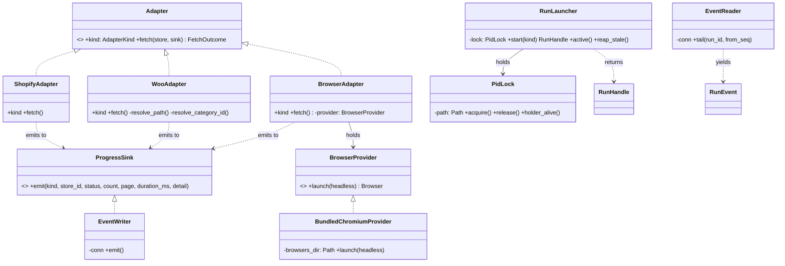
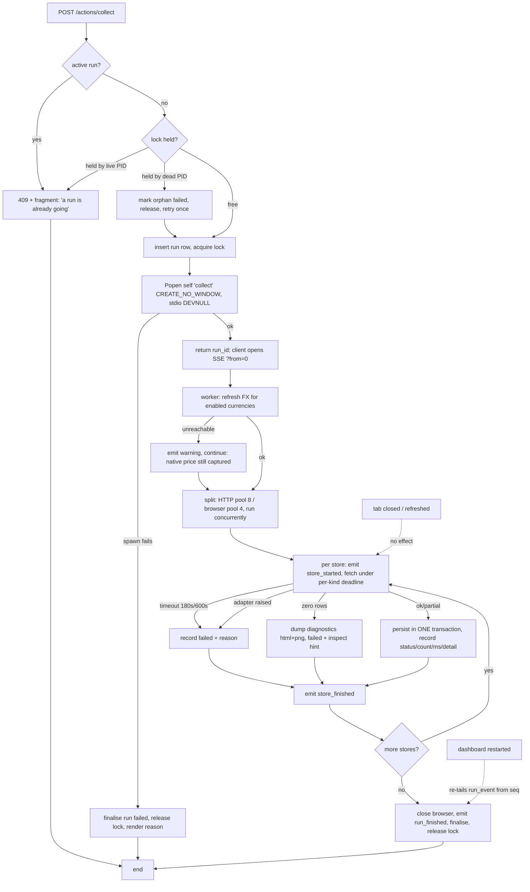
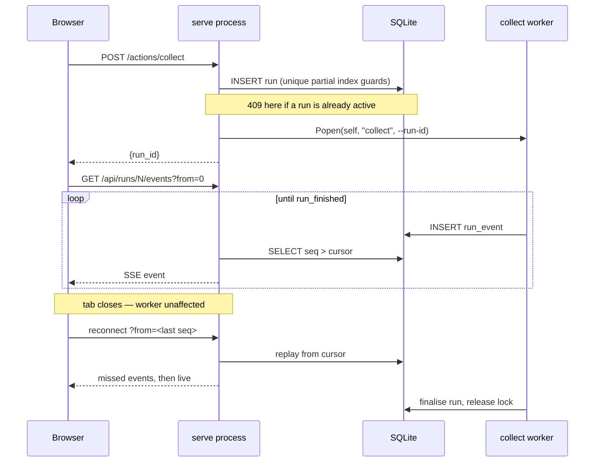

# LLD — switch-tracker Python rewrite — Uniform Self-Invoked Worker (HLD Option 3)

| | |
|---|---|
| **Date** | 2026-08-21 |
| **Status** | draft — ready for implementation |
| **Scope** | **Covers:** full capability port, argv-dispatched worker processes, durable run-event progress + SSE, dashboard-driven controls, PyInstaller `onedir` packaging with bundled Chromium. **Does not cover:** the matcher, the alert engine, Telegram delivery, per-listing history charting (endpoint kept, UI deliberately unbuilt). |
| **HLD source** | `docs/python-rewrite-hld.md` (approved; all 4 blocking questions resolved) |
| **Grounding source** | ⚠️ **None — deliberately skipped.** Greenfield Python package; nothing to reconcile against. The substitute boundary is the verified capability inventory read from all 20 TypeScript source files. Directed by the engineer 2026-08-21. |
| **Alternatives rejected in the HLD** | *Option 1 plan-as-written* — SSE generator running the work makes tab lifetime control run lifetime · *Option 2 job-runner in-process* — keeps the headed-picker special case, puts Chromium in the UI process · *Option 4 don't rewrite* — engineering-optimal but defeats the stated learning purpose · *B3 installed-Edge* — three code paths and version drift, bought a size saving no longer needed · *B4 HTTP-only* — silently loses 7 of 14 stores |

### Safety gates
- **W-1 (hardware):** `N/A — consumer price tracker; no wafer, cassette, interlock or alarm surface.`
- **W-2 (layer boundary):** ✅ Clean. Adapted rule enforced: **UI → orchestration → adapters → core**, top-down only, **no adapter imports another adapter**. Pinned by an automated test (§3.9).
- **New package:** the entire `switch_tracker` package is new — that *is* the deliverable, confirmed by the HLD.
- **Red-flag surfaces:** ⚠️ build (`pyproject.toml`, `uv.lock`, `switch_tracker.spec`) · config (data dir relocates to `%LOCALAPPDATA%`) · schema (one additive table + one index).

### Contents
| § | |
|---|---|
| 1 | Contract changes |
| 2 | Methods quick reference · cross-cutting rules |
| 3.1–3.2 | Package manifest · class diagram |
| 3.3–3.11 | Per-component detail |
| 3.12–3.14 | Wiring · flow diagram · sequence diagram |
| 4 | Execution — build order, tasks, test list |
| 5 | Open items |

---

## 1. Contract changes

**Verdict: eleven new contracts, one of which is the only genuine departure from the TypeScript original — adapters now *emit* progress instead of printing it.**

| Contract | Kind | Purpose | Note vs. TypeScript |
|---|---|---|---|
| `Platform`, `Region`, `Condition`, `ProductKind`, `AdapterKind` | `StrEnum` | Domain vocabulary | `JSON_API` and `MANUAL` **dropped** — they had no adapter and produced `skipped` rows that read as failures |
| `StoreConfig` | frozen dataclass | Store definition | Unchanged shape |
| `RawListing` | frozen dataclass | Adapter output | Unchanged shape |
| `FetchOutcome` | `Ok \| Partial \| Failed` tagged union | Adapter result | Was a TS discriminated union; becomes three frozen dataclasses + `TypeAlias` |
| `Classification` | frozen dataclass | `(platform, kind)` | Unchanged |
| `FxRate` | frozen dataclass | Rate + ECB publication date | Unchanged |
| **`ProgressSink`** | `Protocol` | `emit(kind, *, store_id, status, count, page, duration_ms, detail)` | **NEW — the departure.** Replaces `console.log`. Injected into every adapter |
| **`Adapter`** | `Protocol` | `kind`; `async fetch(store, sink) -> FetchOutcome` | Gains the `sink` parameter |
| **`BrowserProvider`** | `Protocol` | `async launch(headless) -> Browser` | **NEW.** The DIP seam that keeps packaging out of adapter logic |
| **`RunHandle`** | frozen dataclass | `run_id`, `pid`, `kind` | **NEW.** What the UI gets back from launching a worker |
| **`RunEvent`** | frozen dataclass | `seq`, `run_id`, `kind`, `store_id`, `status`, `count`, `page`, `duration_ms`, `detail`, `at` | **NEW.** The durable progress record |

**Why `ProgressSink` is a protocol and not a logger.** The obvious alternative is stdlib `logging` with a custom handler. Rejected: progress here is *structured* (`count`, `page`, `status`, `duration_ms`) and must land in a queryable table that survives a restart, not a text stream someone greps. A protocol also lets tests assert on emitted events directly, and lets the `inspect` worker reuse the same pipe with no special case — `DESIGN_PRINCIPLES.md` ISP: one narrow interface per concept.

**Caller impact: none — there are no existing Python callers.** This is a greenfield package. The claim is backed by the absence of any Python source in the repository, verified when the capability inventory was built. Every consumer named in this LLD is created by this LLD.

---

## 2. Methods — quick reference

| Category | Owner | Key methods | Success / failure semantics | Concurrency |
|---|---|---|---|---|
| Paths | `paths` | `data_dir()`, `db_path()`, `overrides_path()`, `profiles_path()`, `diagnostics_dir()`, `lock_path()` | Creates dirs on first call; raises on unwritable | Pure after first call; memoised |
| Parsing | `core.parse` | `parse_price`, `first_rupee_price`, `classify`, `platform_of`, `infer_region`, `infer_condition`, `normalise_title`, `price_looks_wrong` | Returns `None` on failure, **never `0`** | Pure |
| SKU | `core.skus` | `sku_from_url` | Always returns a non-empty string | Pure |
| HTTP | `core.http` | `get`, `get_json` | Returns `HttpResult(ok=False, status=0)` on exhaustion; **never raises** | Per-host lock + 1.2 s gap |
| DB | `core.db` | `connect`, `ensure_schema`, `migrate` | Raises on corrupt file | One writer process; WAL |
| Adapters | `adapters.*` | `fetch(store, sink)` | `Ok` / `Partial(reason)` / `Failed(reason)` — never raises past the boundary | Bounded by pool |
| Events | `events.writer` | `emit(...)` | Best-effort; a failed emit never aborts a run | Single writer |
| Events | `events.reader` | `tail(run_id, from_seq)` | Async generator; ends on terminal event | Many readers |
| Runs | `web.runs` | `start(kind)`, `active()`, `reap_stale()` | `start` raises `RunAlreadyActive` → HTTP 409 | Triple guard (§3.5) |
| Queries | `web.queries` | `summary`, `health`, `movers`, `listings`, `facets`, `history` | Raise → 500 with a rendered error state | Read-only |

### Cross-cutting rules

1. **One writer at a time.** Exactly one worker process holds the run lock; the UI process writes only the `run` row and the lock. WAL permits concurrent reads. *Beats a write queue in the UI process: it requires no IPC and the guard is needed anyway.*
2. **Adapters never raise across their boundary.** Every failure becomes `Failed(reason)` so `run_store.detail` always carries a human-readable cause — the current system's most valuable diagnostic property.
3. **A silent zero is a failure, not a success.** Zero rows ⇒ `Failed` + a diagnostics dump + an inspect hint in `detail`. Carried verbatim.
4. **Native price is the captured fact.** INR is derived, stored with the ECB rate date used. If no rate exists, `inr_price` is **NULL** — never the native figure (§3.8, fix #2).
5. **No per-store numeric limits.** Ceilings are universal and generous; real stopping signals do the work. Carried verbatim.
6. **Order-preserving concurrency.** `bounded_gather` preserves input order regardless of completion order, so probe output stays stable.
7. **Decisions delegated by the engineer (2026-08-21):** packaging B1 · scheduling = manual + collect-on-launch toggle · matcher/alerts out of scope · reuse the existing DB file · code signing skipped. Recorded here so the implementer does not re-open them.

---

## 3. The design

### Idea

The exe is one binary with five personalities chosen by `argv[1]`. Run as `serve`, it is a read-mostly FastAPI dashboard that never imports Playwright or a single adapter; when you click a button it launches **itself** as `collect`/`probe`/`fx`/`inspect` in a child process and returns immediately. The child streams structured progress into a `run_event` table; the dashboard tails that table and re-broadcasts it over SSE with a replay cursor. Close the tab, refresh it, or restart the dashboard — the run is unaffected and the progress replays from disk.

### 3.1 Package structure

```
pyproject.toml                              ← NEW  deps, ruff, mypy strict
uv.lock                                     ← NEW
switch_tracker.spec                         ← NEW  PyInstaller onedir
docs/python-rewrite-hld.md                  ← MODIFIED (already: decisions recorded)
docs/python-rewrite-plan.md                 ← MODIFIED  amend SSE + Distribution sections
README.md                                   ← MODIFIED  menu table → dashboard controls
src/switch_tracker/
  __init__.py                               ← NEW
  __main__.py                               ← NEW  argv dispatch: serve|collect|probe|fx|inspect
  paths.py                                  ← NEW  the ONLY module that knows %LOCALAPPDATA%
  settings.py                               ← NEW  collect-on-launch toggle, PORT, HEADFUL
  core/
    models.py                               ← NEW  enums, dataclasses, FetchOutcome union
    parse.py                                ← NEW  PORT-CRITICAL: all regex sets verbatim
    skus.py                                 ← NEW  PORT-CRITICAL: sku_from_url
    db.py                                   ← NEW  schema (7 tables byte-identical) + run_event
    http.py                                 ← NEW  per-host lock + 1.2s gap + retry
    concurrency.py                          ← NEW  bounded_gather, order-preserving
  config/
    stores.py                               ← NEW  the 14 store configs
    overrides.py                            ← NEW  stores.local.json merge
  adapters/
    base.py                                 ← NEW  Adapter + ProgressSink protocols
    registry.py                             ← NEW  kind → adapter
    shopify.py                              ← NEW
    woocommerce.py                          ← NEW  ⚠ expectedTotal bug FIXED, not ported
    browser/
      adapter.py                            ← NEW  orchestrates the 4 extraction layers
      provider.py                           ← NEW  bundled-Chromium resolution (B1)
      profiles.py                           ← NEW  the 7 store profiles, verbatim
      overrides.py                          ← NEW  profiles.local.json, prepend-merge
      extract.py                            ← NEW  jsonld / flipkart-state / selectors / rupee
      pagination.py                         ← NEW  url-template + click-next strategies
      diagnostics.py                        ← NEW  html + fullpage png dump
  fx/rates.py                               ← NEW  Frankfurter; ⚠ to_inr NULL-on-missing fix
  events/
    models.py                               ← NEW  RunEvent
    writer.py                               ← NEW  worker side
    reader.py                               ← NEW  UI side async tailer
  services/
    collect.py                              ← NEW  worker entry
    probe.py                                ← NEW  worker entry
    fx_refresh.py                           ← NEW  worker entry
    inspect.py                              ← NEW  worker entry (headed)
  web/
    app.py                                  ← NEW  FastAPI factory + uvicorn bootstrap
    runs.py                                 ← NEW  launcher, triple guard, stale-PID reaping
    queries.py                              ← NEW  the 6 read queries, all SQL-side
    errors.py                               ← NEW  ⚠ real status codes, not {error} + 200
    routers/pages.py                        ← NEW  dashboard shell + htmx fragments
    routers/actions.py                      ← NEW  POST /actions/*
    routers/data.py                         ← NEW  the 6 JSON endpoints
    routers/events.py                       ← NEW  SSE with ?from=<seq>
    templates/*.html                        ← NEW  index + 3 fragments
    static/app.css                          ← NEW
    static/htmx.min.js                      ← NEW  VENDORED — no CDN
tests/
  test_parse.py            test_skus.py            ← NEW  port-critical, pure
  test_db_schema.py        test_http_politeness.py ← NEW
  test_adapters_*.py       test_events.py          ← NEW
  test_runs_guard.py       test_queries.py         ← NEW
  test_import_boundary.py                          ← NEW  the W-2 enforcement test
  test_frozen_smoke.py                             ← NEW  runs against the built exe
```

**Count: 48 new · 3 modified · 0 deleted.** The TypeScript `src/` tree is left in place until the Python build reaches parity, then removed in a separate commit — not part of this LLD.

### 3.2 Class diagram



### 3.3 `paths` — the single choke point

- **Why one module.** The current system's `stores.local.json` is a bare relative path resolving against CWD; in a double-clicked exe that lands wherever Explorer decided. Centralising every mutable path makes the bug unrepresentable rather than fixed.
- **Algorithm.**
  1. `base = %LOCALAPPDATA%\switch-tracker` on Windows; `~/.local/share/switch-tracker` elsewhere.
  2. Honour `TRACKER_DATA_DIR` if set — keeps the Docker path and tests viable.
  3. `mkdir(parents=True, exist_ok=True)`; memoise.
  4. **Warn if the resolved path contains `OneDrive`** — the README's known SQLite-corruption hazard, surfaced in the dashboard health strip rather than left as folklore.
- **Bundled read-only resources use `importlib.resources`, not `sys._MEIPASS`.** `_MEIPASS` exists only in a frozen build, so template loading silently diverges between dev and exe — the exact class of bug that only appears after packaging.

### 3.4 `__main__` — argv dispatch

| argv[1] | Process role | Imports Playwright? |
|---|---|---|
| `serve` (default) | Dashboard; launches workers | **No — enforced by test** |
| `collect` | Worker: full collection run | Yes, if browser stores enabled |
| `probe` | Worker: detection + category discovery | No |
| `fx` | Worker: FX refresh | No |
| `inspect <store_id>` | Worker: **headed** selector picker | Yes |

- Adapter/Playwright imports are **inside** the worker branches, never at module top level. This is what makes the boundary test meaningful rather than decorative.
- `multiprocessing.freeze_support()` is the first statement, before any import that could spawn.

### 3.5 `web.runs` — the triple concurrency guard

- **Why three layers.** A browser gives three independent ways to double-fire an expensive action; the current terminal menu only had one. Defence in depth, cheapest layer first.

| Layer | Mechanism | Catches |
|---|---|---|
| 1 — cosmetic | `hx-disabled-elt="this"` | Double-click. **Never trusted as the guard** |
| 2 — authoritative | `CREATE UNIQUE INDEX idx_run_active ON run(1) WHERE finished_at IS NULL` | Refresh, second tab, race |
| 3 — cross-process | PID lock file in the data dir | A second exe instance |

- **Stale-PID reaping.** On `start` and on `serve` boot: read the lock's PID; if no live process holds it, mark the orphaned run `failed` with `detail='interrupted'`, release the lock, retry **once**. *Beats a timestamp heuristic — a PID check is a fact, a timeout is a guess, and a legitimate 600 s browser run would trip any sane timeout.*
- **Windows subprocess flags** — both required, and both fail only in the frozen build:
  - `creationflags=CREATE_NO_WINDOW` — otherwise every worker flashes a console window.
  - `stdin/stdout/stderr=DEVNULL` — a `--windowed` parent has invalid std handles; children inheriting them fail to launch.
- `sys.executable` under PyInstaller **is** the exe, so `Popen([sys.executable, "collect", "--run-id", str(n)])` re-invokes the same binary. Unfrozen it is the interpreter, so the launcher prepends `-m switch_tracker` when `not getattr(sys, "frozen", False)`.

### 3.6 `events` — durable progress with replay

- **Schema (the only additive table).**

```sql
CREATE TABLE IF NOT EXISTS run_event (
  seq         INTEGER PRIMARY KEY AUTOINCREMENT,
  run_id      INTEGER NOT NULL REFERENCES run(id),
  at          TEXT    NOT NULL,
  kind        TEXT    NOT NULL,   -- run_started|store_started|store_progress|
                                  -- store_finished|run_finished|warning
  store_id    TEXT,
  status      TEXT,               -- ok|partial|failed|skipped
  count       INTEGER,
  page        INTEGER,
  duration_ms INTEGER,
  detail      TEXT
);
CREATE INDEX IF NOT EXISTS idx_run_event_run_seq ON run_event(run_id, seq);
```

- **Writer (worker).** Autocommit inserts, outside the persistence transaction — progress must be visible *during* a run, not at its end. A failed emit is swallowed: diagnostics must never abort collection.
- **Reader (UI).** `tail(run_id, from_seq)` polls `WHERE run_id=? AND seq>? ORDER BY seq` every 250 ms via `asyncio.to_thread`, yields rows, ends on `run_finished`. *Polling beats a notify mechanism here: SQLite has no cross-process notification, 250 ms is imperceptible against 600 s runs, and it costs one indexed query.*
- **Replay is what makes it durable.** `GET /api/runs/{id}/events?from=<seq>` — the browser's `EventSource` reconnects automatically, the client sends its last `seq`, nothing is lost. A restarted dashboard rebuilds identically because the state is on disk, not in memory.
- **`run_event` carries strictly more than today's `run_store.detail`:** every field of it, plus live `page` counters that previously existed only as ephemeral stdout.

### 3.7 Adapters — three fetchers, one contract

**Shopify** (`shopify.py`) — port unchanged: `/collections/<h>/products.json` or `/products.json`, `limit=250`, universal `MAX_PAGES=100` backstop, real stop on `len(products) < PAGE_SIZE`, `variants[0]`, context = title + product_type + tags.

**WooCommerce** (`woocommerce.py`) — port with **one fix**:
- Dual path probe, numeric term-id resolution via `/wp-json/wp/v2/product_cat?slug=`, minor-unit division, context = name + category names.
- ⚠️ **Fix #1 — `expected_total` accumulation.** The TS code does `expectedTotal += total` *inside* the page loop, so a 213-item category over 3 pages reports "213 of 639 → partial". Correct behaviour: capture `x-wp-total` **once per category query**, first page that carries it. *Not a dirty fix — this is a defect the HLD disclosed in §4.7 #4 and explicitly instructed not to reproduce.*

**Browser** (`browser/`) — the largest port; decomposed because the TS original is one 709-line file:
- `provider.py` — B1: set `PLAYWRIGHT_BROWSERS_PATH` to the bundled dir **before** importing Playwright, then `chromium.launch(headless=...)`. One code path. If the bundled dir is missing, fail with a readable reason and mark browser stores `skipped` — this is what finally makes the `TRACKER_NO_BROWSER` degradation real (it is currently documented but read by no source file).
- `extract.py` — the four layers in order: JSON-LD (`@graph`/`itemListElement`/`item`/`mainEntity` walk) → Flipkart `__INITIAL_STATE__` structural walk (depth ≤ 12, cycle-guarded) → CSS selectors → `first_rupee_price` on card text. Title fallback chain `titleSelectors → a[title] → img[alt]`; `:has-text()` emulated as a substring match.
- `pagination.py` — URL `{p}` template, or `click_next` using `.last()` with `is_disabled()` as the real end signal. Stop conditions verbatim: empty page (hard), or `new/rows < 0.15` sustained **4** pages; `MAX_PAGES_SAFETY=300`; `seen_skus` and `stale_streak` reset **per search URL**.
- Context config **must** include `locale="en-IN"`, `timezone_id="Asia/Kolkata"`, the Win10 UA, viewport 1440×960, `accept-language` — Amazon and Play-Asia price by locale.
- Stealth init script, image/font route abort, diagnostics dump on zero rows only.

### 3.8 The two remaining fixes

- ⚠️ **Fix #2 — `to_inr` must not invent a price.** TS returns the native figure with no rate date when no rate is stored, so a USD price is recorded as if it were rupees. Correct: return `(None, None)` and store `inr_price` **NULL**. Requires making `price_point.inr_price` nullable — the one place the schema is *not* byte-identical. *Justified: recording a wrong number is worse than recording no number, and the plan's first non-negotiable is that INR is derived, never captured.*
- ⚠️ **Fix #3 — real HTTP status codes.** TS returns `{error}` with **200** and the page dereferences it unguarded, so a backend fault renders as a JavaScript type error. Correct: 4xx/5xx plus a rendered error state; the dashboard shows the reason.

### 3.9 The import-boundary test — W-2 made mechanical

```python
# tests/test_import_boundary.py — the design's own regression test
def test_ui_process_never_loads_playwright_or_adapters():
    subprocess.run([sys.executable, "-c",
        "import switch_tracker.web.app, sys;"
        "assert not [m for m in sys.modules if 'playwright' in m or 'adapters' in m]"
    ], check=True)
```

- Run in a **subprocess** — an in-process assertion is worthless once pytest has imported adapters for other tests.
- This single test is what stops Option 3's central benefit eroding the first time someone adds a convenient import.

### 3.10 `core.http` — politeness

- Per-host `asyncio.Lock` **plus** a `last_hit` timestamp map, minimum gap 1.2 s, 20 s timeout, 3 attempts, retry only on 429/5xx (403/404 are answers), backoff `1.5 s × attempt²`, headers lower-cased so `x-wp-total` is readable.
- ⚠️ **A `Semaphore(1)` per host is not equivalent** — it serialises but does not space. The plan's wording implies the semaphore suffices; it does not.
- Host-lock map is bounded by eviction — the UI process is now long-lived, unlike today's short CLI.

### 3.11 `web` — dashboard controls

| Method | Path | Returns |
|---|---|---|
| `GET` | `/` | Shell |
| `POST` | `/actions/{collect\|probe\|fx\|reset-corrections}` | `{run_id}` or **409** |
| `POST` | `/actions/inspect/{store_id}` | Spawns the headed picker |
| `GET` | `/api/runs/{id}/events?from=<seq>` | SSE, replayable |
| `GET` | `/api/{summary\|health\|movers\|listings\|facets\|history}` | JSON, ported SQL verbatim |

- All filtering/sorting/pagination stays **in SQL** — the sort-column whitelist, the `latest` CTE, `LIMIT/OFFSET`, the `l.id ASC` tie-break, the `%`/`_` stripping. Carried verbatim.
- `/api/history` is kept and left **unconsumed**, exactly as today. Charting is a deliberate new feature, not a port (HLD §4.7 #3).
- **Collect-on-launch**: `serve` checks the toggle at boot and, if set, calls the same `RunLauncher.start("collect")` a button would. One mechanism, no special case.

### 3.12 Wiring — construction order

1. `freeze_support()` → parse argv → `settings.load()` → `paths.data_dir()` (creates, warns on OneDrive).
2. `db.connect()` → `ensure_schema()` (7 tables verbatim + `run_event` + partial unique index) → `migrate()`.
3. **`serve`:** `RunLauncher(PidLock(paths.lock_path()))` → `reap_stale()` → routers → `uvicorn.run(app_object)`.
4. **worker:** `EventWriter(conn, run_id)` → `overrides.active_stores()` → `registry.adapter_for(kind)` → `BundledChromiumProvider` **only if** a browser store is enabled → run → `close_browser()` → finalise → release lock.

### 3.13 Flow — "Collect Prices"



### 3.14 Sequence — progress delivery



---

## 4. Execution

**Build order:** contracts → pure core → I/O core → adapters → events/services → web → packaging → docs. Task 1 gates everything by de-risking, not by dependency.

| # | Task | Depends on | Acceptance test | Parallel? |
|---|---|---|---|---|
| **1** | **De-risking spike** — FastAPI one page + Playwright one URL, bundled Chromium, PyInstaller `onedir`, run on a clean machine | — | Exe launches, page renders, Playwright opens a real URL, HTTPS succeeds. **Proves certifi + templates + uvicorn-frozen + driver at once** | ❌ blocks all |
| 2 | `pyproject`, `uv.lock`, ruff + mypy strict, CI task | 1 | `uv run ruff check && uv run mypy` clean | ❌ |
| 3 | `core/models.py` — enums, dataclasses, `FetchOutcome` | 2 | mypy strict passes | ❌ |
| 4 | **`core/parse.py`** — all regex sets verbatim | 3 | Test list below — **TDD, tests first** | ✅ **A** |
| 5 | **`core/skus.py`** | 3 | Test list below — **TDD, tests first** | ✅ **A** |
| 6 | `paths.py` + `settings.py` | 3 | Resolves under LOCALAPPDATA; OneDrive warning fires | ✅ **A** |
| 7 | `core/db.py` — 7 tables + `run_event` + index | 6 | **Opens an existing `tracker.db` untouched**; `PRAGMA integrity_check` clean | ✅ **B** |
| 8 | `core/http.py` + `concurrency.py` | 3 | Two requests to one host ≥1.2 s apart; order preserved | ✅ **B** |
| 9 | `config/stores.py` + `overrides.py` | 3, 6 | 14 stores load; override merge correct | ✅ **B** |
| 10 | `adapters/base.py` + `registry.py` | 3 | Protocol conformance | ❌ |
| 11 | `adapters/shopify.py` | 8, 10 | Recorded-fixture fetch → expected listings | ✅ **C** |
| 12 | `adapters/woocommerce.py` | 8, 10 | **3 pages × `x-wp-total`=213 ⇒ `ok`, not `partial`** (fix #1) | ✅ **C** |
| 13 | `adapters/browser/*` | 8, 10, 1 | Each of the 4 layers extracts from a saved fixture; click-next stops on disabled | ✅ **C** |
| 14 | `fx/rates.py` | 7, 8 | **No stored rate ⇒ `inr_price` NULL, not the native figure** (fix #2) | ✅ **C** |
| 15 | `events/*` | 7 | Writer→reader round-trip; replay from mid-`seq` loses nothing | ❌ |
| 16 | `services/collect.py` | 11–15 | Pools 8/4, deadlines 180/600, one transaction per store | ❌ |
| 17 | `services/probe.py` + `fx_refresh.py` | 9, 14, 15 | 5 findings; never writes a kind lacking an adapter | ✅ **D** |
| 18 | `services/inspect.py` | 13 | Headed window; Alt+click writes `profiles.local.json` prepend | ✅ **D** |
| 19 | `web/runs.py` — triple guard | 7, 15 | Second POST ⇒ 409; dead PID reaped; `CREATE_NO_WINDOW` set | ❌ |
| 20 | `web/queries.py` + `errors.py` | 7 | Ported SQL matches TS output on a fixture DB; **errors return 4xx/5xx** (fix #3) | ✅ **D** |
| 21 | `web/routers/*` + templates + vendored htmx | 19, 20 | Every control works; no CDN reference anywhere | ❌ |
| 22 | **`test_import_boundary.py`** | 21 | UI import graph contains no `playwright`, no `adapters` | ❌ |
| 23 | `switch_tracker.spec` — full `onedir` build | 21 | Clean-machine run: all 14 stores, collect end-to-end | ❌ |
| 24 | Docs — README, amend plan §SSE + §Distribution | 23 | Reviewer can install and run from the README alone | ✅ **D** |

**Parallel groups:** A (4, 5, 6) · B (7, 8, 9) · C (11–14) · D (17, 18, 20, 24). Everything else is sequential.

### Port-critical test list — write these first

These six functions are pure and their current behaviour is fully known, so they are the highest-value tests in the project. Expected values are taken from the TypeScript implementation.

| Function | Cases |
|---|---|
| `parse_price` | `"₹4,499.00"`→4499 · `"Rs. 4499"`→4499 · `"INR 4,499"`→4499 · `"4.499,00"`→4499 · **`"₹3,599"`→3599** (lone comma = thousands; the ÷1000 regression) · `"1,234,567"`→1234567 · `"₹1,299.50"`→1299.5 · `4499`→4499 · `""`→None · `None`→None · `"abc"`→None · `inf`→None |
| `classify` | **`"Nintendo Switch Pro Controller"`→HARDWARE** (exclusion precedes platform) · `"Nintendo Switch OLED Console"`→HARDWARE · `"Switch Carrying Case"`→ACCESSORY · `"amiibo"`→ACCESSORY · `"Cooling Pad"`→ACCESSORY · `"eShop Gift Card"`→DIGITAL · `"Switch Online Membership"`→DIGITAL · `"Nintendo OLED game loading service"`→SERVICE · `"Hogwarts Legacy"`+hint→GAME/SWITCH · `"Hogwarts Legacy"` no hint→UNKNOWN · **`"Hogwarts Legacy PS5"`+hint SWITCH→UNKNOWN** (other console beats hint) · `"FIFA 23 Xbox"`+hint→UNKNOWN · `"Mario Kart World Switch 2"`→SWITCH2 · `"Hogwarts Legacy NSW"`→SWITCH |
| `infer_region` | `"(Asia English)"`→ASIA_EN · `"Asia Chinese"`→ASIA_ZH · `"JP"`→JP · `"NTSC-U"`→US · `"PAL"`→EU · `"Asia"`→ASIA_EN (last rule) · plain title→store default |
| `infer_condition` | `"Pre-Owned Games"`→PRE_OWNED · `"Used"` · `"Open Box"` · `"Refurbished"` · `"Renewed"` · `"Second-hand"` · plain title→**NEW** (default) |
| `normalise_title` | `"...Zelda: TotK (Nintendo Switch)"`→`"the legend of zelda tears of the kingdom"` · `"Hogwarts Legacy NSW [Asia]"`→`"hogwarts legacy"` · strips brackets, region parens, condition words, collapses whitespace |
| `sku_from_url` | `/dp/B0CQNVQD9N?ref=x`→`B0CQNVQD9N` · `/Some-Title/dp/B0CQNVQD9N/`→`B0CQNVQD9N` · `?pid=XYZ123`→`XYZ123` · **ASIN wins when both present** · `/product/mario-kart`→`mario-kart` · trailing slash ignored · >120-char segment sliced to 120 · **same URL twice ⇒ identical SKU** (the history-continuity property) |

**Mandatory integration test, shipped with the PR:** a full `collect` against recorded fixtures for one store of each kind, asserting `run_store` rows, `price_point` append-only behaviour, and a complete `run_event` sequence ending in `run_finished`.

---

## 5. Open items

**None blocking.** Three carried forward from HLD §6, none of which gates implementation.

| Item | Status |
|---|---|
| Docker's fate after the rewrite | Unresolved — decide before the TS tree is deleted, or it lapses silently |
| Unify the three completeness signals behind one "confidence" concept | Deferred — `run_event`'s uniform contract makes this cheaper later than now (YAGNI) |
| DesignInfo: term id reports 1 product, storefront shows 100+ | Needs a live re-check; **do not reproduce or "fix" without fresh evidence** |
| `price_point.inr_price` becomes nullable | The single schema deviation from byte-identical. Additive and backward-compatible — existing rows are unaffected |
| `price_looks_wrong`, `infer_platform` are dead code in TS | Port `normalise_title` (matcher seam). Wire `price_looks_wrong` into a `partial` reason, or drop it — implementer's call, but it must be a decision, not an oversight |

---

### LLD TL;DR
- **Design**: HLD Option 3 — one exe, five argv personalities; the dashboard launches *itself* as worker subprocesses and tails a durable `run_event` table over replayable SSE.
- **Files**: 48 new, 3 modified, 0 deleted.
- **Contract changes**: 11 new contracts; the only real departure is `ProgressSink` replacing `console.log`. **Callers affected: none** — greenfield package, no existing Python source.
- **Workaround debt**: None — structural. The headed-picker special case present in HLD Options 1–2 is designed out by making subprocess launch the uniform mechanism.
- **W-1**: None — no hardware surface.
- **Red-flag surfaces**: ⚠️ build (`pyproject`, `uv.lock`, `switch_tracker.spec`) · config (data dir → `%LOCALAPPDATA%`) · schema (`run_event` + partial unique index + `inr_price` nullable).
- **Boundary**: ⚠️ No grounding run — deliberately skipped as greenfield, per engineer direction. Substitute boundary is the source-verified capability inventory.
- **Open items**: 5 — none blocking; most consequential is Docker's fate before the TypeScript tree is removed.
- **Ready for implementation**: ✅ Yes — start at Task 1, the spike. Do not write production code until it passes on a clean machine.
